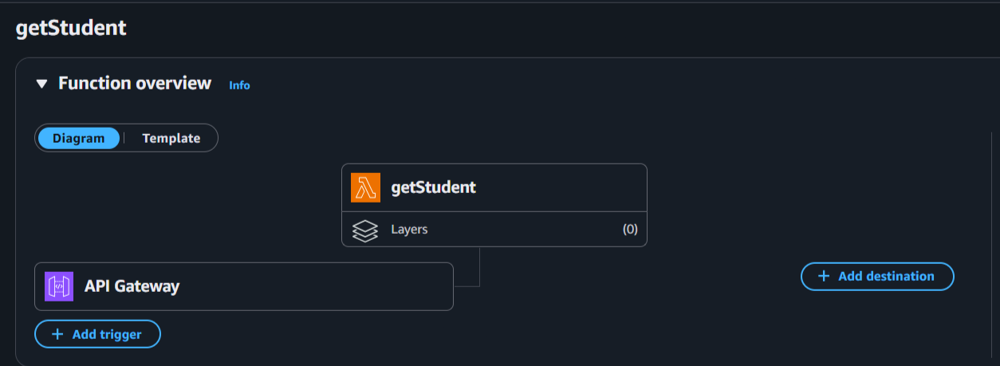

<h1 align="center">🚀 Serverless Web Application on AWS</h1>
<p align="center">
  <b>A modern, scalable serverless web application built with AWS cloud services - demonstrating the power of serverless architecture in action!</b>
</p>

<p align="center">
  <a href="https://aws.amazon.com/"></a>
  <a href="https://www.serverless.com/"></a>
  <a href="https://javascript.info/"></a>
</p>

---

## 📸 Screenshots

<p>
  <b>Lambda Function</b><br>
  

  <b>Lambda Metrics</b><br>
  

  <b>S3 Bucket</b><br>
  

  <b>API Gateway - Production Stage</b><br>
  

  <b>Web Interface</b><br>
  
</p>

---

## 📋 Table of Contents

- [🎯 Project Overview](#-project-overview)
- [🏗️ Architecture](#️-architecture)
- [✨ Features](#-features)
- [🛠️ AWS Services Used](#️-aws-services-used)
- [📁 Project Structure](#-project-structure)
- [📸 Screenshots](#-screenshots)
- [🤝 Contributing](#-contributing)
- [📄 License](#-license)

---

## 🎯 Project Overview

This project demonstrates how to build a **fully serverless web application** using AWS cloud services. The application showcases modern serverless architecture patterns, automatic scaling, and cost-effective cloud computing without managing any servers.

### 🎨 What Makes This Special?

- 💰 **Cost-Effective**: Pay only for what you use
- 📈 **Auto-Scaling**: Handles traffic spikes automatically  
- ⚡ **High Performance**: Sub-second response times
- 🔒 **Secure**: Built-in AWS security features
- 🌍 **Global**: CloudFront CDN for worldwide performance

---

## 🏗️ Architecture

<p align="center">
  
</p>


---

## ✨ Features

### 🔐 **Authentication & Authorization**
- User registration and login
- Secure JWT token management
- Protected routes

### 💾 **Data Management**
- Real-time data operations
- NoSQL database integration
- Automatic backups

### 🌐 **Web Interface**
- Responsive design
- Modern UI/UX
- Cross-browser compatibility

### ⚡ **Performance**
- Global content delivery
- Optimized API responses
- Lazy loading implementation

---

## 🛠️ AWS Services Used

| Service | Purpose | Benefits |
|---------|---------|----------|
| 🪣 **S3** | Static website hosting | Reliable, scalable storage |
| ⚡ **Lambda** | Serverless compute | Auto-scaling, cost-effective |
| 🚪 **API Gateway** | REST API management | Built-in throttling & monitoring |
| 🗄️ **DynamoDB** | NoSQL database | High performance, managed |
| 🔐 **Cognito** | User authentication | Secure, managed auth service |
| 🌍 **CloudFront** | Content delivery | Global edge locations |
| 📊 **CloudWatch** | Monitoring & logging | Real-time insights |

---

## 🚀 Getting Started

### Prerequisites

Before you begin, ensure you have:

- ✅ AWS Account with appropriate permissions
- ✅ AWS CLI installed and configured
- ✅ Python (v14 or later)
- ✅ Git installed

5. **Access your application**
   ```
   🎉 Your app will be available at the CloudFront URL provided after deployment!
   ```

---

## 📁 Project Structure

```
serverless-web-app/
├── 📄 .env
├── 📄 .gitignore
├── 📄 README.md
├── 📄 getStudents.py
├── 📄 index.html
├── 📄 insertStudentData.py
├── 📄 scripts.js
├── 📂 Reference/
│   ├── banner.png
│   ├── app-screenshot1.png
│   ├── app-screenshot2.png
│   └── architecture-diagram.png

```

---

## 🔧 Configuration

### Environment Variables

Create a `.env` file in the root directory:

```env
# AWS Configuration
AWS_REGION=us-east-1
AWS_ACCOUNT_ID=your-account-id

# Application Settings
APP_NAME=ServerlessWebApp
STAGE=dev

# API Configuration
API_ENDPOINT=your-api-gateway-endpoint
```

## 🎯 Key Learning Outcomes

After completing this project, you'll understand:

- ☁️ **Serverless Architecture Patterns**
- 🔐 **AWS Security Best Practices**
- 📊 **Monitoring and Logging**
- 💰 **Cost Optimization Techniques**
- 🚀 **CI/CD for Serverless Applications**

---
### 📋 Contribution Guidelines

- Follow existing code style
- Add tests for new features
- Update documentation as needed
- Ensure all tests pass

---

## 📊 Performance Metrics

| Metric | Value |
|--------|-------|
| 🚀 **Cold Start** | < 500ms |
| ⚡ **API Response** | < 100ms |
| 🖥️ **Page Load** | < 2s |
| 🔒 **Availability** | 99.9% |

---

## 💡 Next Steps

Ready to take this further? Consider:

- 🔄 **Add CI/CD Pipeline** with AWS CodePipeline
- 📱 **Mobile App Integration** 
- 🤖 **AI/ML Features** with Amazon SageMaker
- 📈 **Advanced Analytics** with Amazon Kinesis
- 🔔 **Real-time Notifications** with SNS/SQS

---

## 📄 License

This project is licensed under the MIT License - see the [LICENSE](LICENSE) file for details.

---

## 🙏 Acknowledgments

- AWS Documentation and Tutorials
- Serverless Framework Community
- Open Source Contributors

---

<div align="center">

### ⭐ Star this repository if it helped you!

**Built with ❤️ and ☁️ AWS**

[🔝 Back to Top](#-serverless-web-application-on-aws)

</div>
